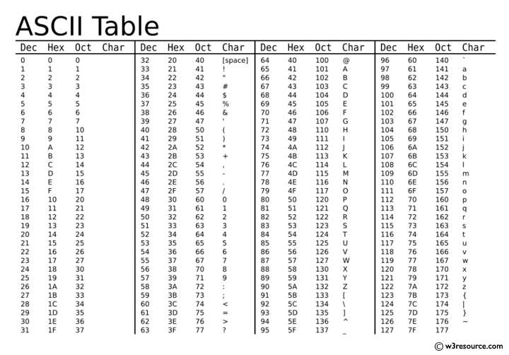

# Strings in depth

```python
name = "Randy"
last = "Henry"
full_name = name + " " + last

name.isupper() # false
name.lower()  # "randy"
```

The way we deal with strings:
and how the computer represents strings

## String representation

### Ascii



_American Standard Code for Information Interchange_

- A string is a sequence of characters
- Each character takes 1 byte of memory
- Every character is represented by
  a number between 0 and 127.
  - This is called the _ordinal_ value
    of the character.

97 == 'a'

`ord` function
`chr` function

The order that numbers show up in
is alphabetical.

_But uppercase letters show up before
lowercase letters._

This has implications when we're trying to **sort strings**.

## How python sorts strings

Strings are compared by their _code points_

1. The first two characters are compared
   - If they're different, then it will use this
     difference to compare the entire string
   - If they're the same, it'll check the next two chars.

# Unicode

Much more expansive than ASCII

Much larger ASCII table
that can represent pretty much\*
every known character.

Unicode, just like ASCII,
is just a standard.

Python uses an implementation of
Unicode called _utf-8_

## Encoding and decoding

Given a character '测',
this character can be encoded into utf-8.

## UTF-8

Given a character '测',
it will a convert it into
a series of 'bytes' that
represent that character.

UTF-8 is compatible with ascii.

### Character

- smallest "unit" of text
- what we think of when we say "letter"

### Code point

a nonnegative integer that represents a character

We typically write these out using hexademical notation.

A unicode bytestring is a sequence of code points.

The rules for how we convert that bytestring
into a regular string is the **UTF-8 encoding**.

# Bytes vs strings

When we send data, all we're
sending is raw bytes.

Python has the `bytes` data
type for this use case.

## Sending files

### Using `open`

When we're sending data
that isn't valid unicode text,
we use "binary mode."

    'r'       open for reading (default)
    'w'       open for writing, truncating the file first
    'b'       binary mode
    't'       text mode (default)
