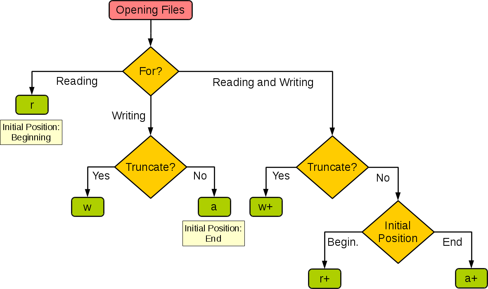

#  Files

### For the exam

- Distinguish text and bytes/binary content

- know when to use which mode

- common patterns for
    - opening files
    - reading files
    - writing data to files

# Modes

# First piece: Access

### "r": READ MODE

Opens the file for reading.

If the file doesn't exist, it'll throw an exception
FileNotFoundError

### "w": WRITE MODE

**Truncates** the file, and allows you to write to it
If the file already existed before we tried to open it,
it will be cleared.

Create the file if it doesn't already exist.

### "a": APPEND MODE

Allows you to write to the file, but instead of truncating,
it'll start you off at the end, so you can write
AFTER the content that's already there.

Create the file if it doesn't already exist.

## Update modes

Add a `+` at the end of "r", "w", "a"
It will add reading and writing capabilities.

### `"r+"` : Read & Update

You can read from the file,

write to the file,

but it won't create the file if it doesn't exist.

### `"w+"` : Write & Update

Allows reading access on top of writing.
Still truncates.

### `"a+"` : Append & Update

Allows reading access on top of writing.
Still doesn't truncate.



| Operation             | r | r+ | w | w+ | a | a+
| ----------------------|---|----|---|----|---|----
| **read**              | ✔ | ✔  |   | ✔ |   | ✔
| **write**             |   | ✔  | ✔ | ✔ | ✔ | ✔
| **create**            |   |    | ✔ | ✔ | ✔ | ✔
| **truncate**          |   |    | ✔ | ✔ |   |
| **start at begin**     | ✔ | ✔ | ✔ | ✔  |   |
| **start at end**      |   |    |   |    | ✔ | ✔

# Second part: Content modes

## `"t"` : TEXT MODE

## `"b"` : BINARY/BYTES MODE

Doesn't make any assumptions about the file
or whether it's Unicode compliant or anything.
It's just bytes.


---

# Standard Streams

Standard streams are **pre-opened**,
and you don't need to close them.
In fact, you can't.

There are 3 files that are implicitly available to you.

*Pronounced Standard input, standard output, standard error*

`sys.stdin, sys.stdout, sys.stderr`


## `sys.stdout`

Associated with the screen/the console.

Pre-opened for writing

The primary way you output data that you want to be seen.

```python
name = "randy"
print(name)
```

`print` writes to `sys.stdout` behind the scenes.

```python
name = "randy"
sys.stdout.write(name + '\n')
```

## `sys.stdin`

Associated with the keyboard

Pre-opened for reading

When the user types something in,
they're really writing data to
this magic `sys.stdin` file.

We have read access to this file.

`input` reads from `sys.stdin` behind the scenes.


```python
name = input("What's your name? ")
print("Hi " + name + "!")  # Hi randy!
```

```python
sys.stdout.write("What's your name? ")
name = sys.stdin.readline()
sys.stdout.write("Hi " + name + "!\n")
```

## `sys.stderr`

The exact same as `sys.stdout`

Theres a convention that we should write out any errors
to `stderr` instead of `stdout`.

`stdout` should really only be for general info, NOT
catastrophic errors


# `bytearray`s

Very similar to `bytes`,
except that it's **mutable**.

So we can do things like, change the first element.

* bytearrays have a fixed length
* byearrays are used to read from/write to binary files
* file objects have a `readinto` method
    that reads binary data into the bytearray.
* `bytearrays` are **mutable**, unlike `bytes` objects.


```python
# copies ascii.png to newAscii.png
src = open("docs/ascii.png", "rb")
dst = open("newAscii.png", "wb")

array = bytearray(60_000)
num_bytes_read = src.readinto(array)
while num_bytes_read > 0:
    dst.write(array[:num_bytes_read])
    num_bytes_read = src.readinto(array)
```
